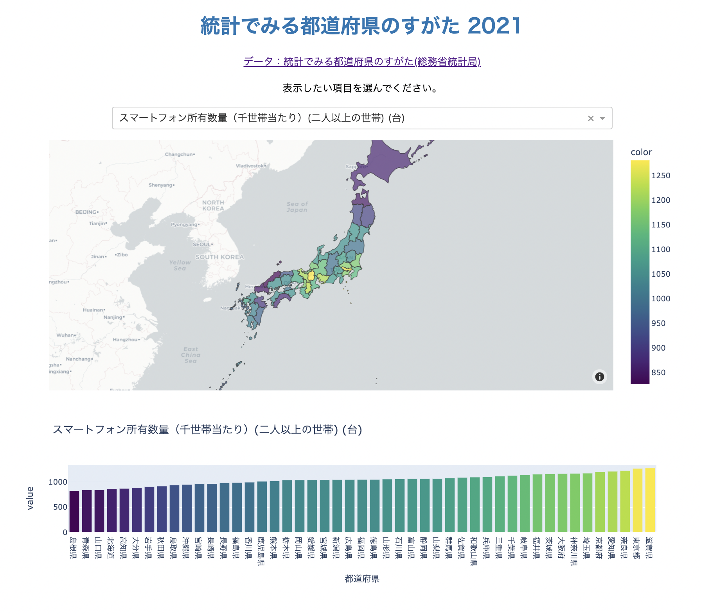

# prefecture-stat

# 都道府県統計マップ

[https://prefecture-stat.herokuapp.com/](https://prefecture-stat.herokuapp.com/){:target="_blank"}

都道府県ごとの様々な統計データを地図とヒストグラムで可視化

元データ: [ 総務省統計局データ「統計でみる都道府県のすがた」](https://www.stat.go.jp/data/k-sugata/index.html){:target="_blank"}

* app.py

  本体。dashで動作

* data/all_data.csv

  「統計でみる都道府県のすがた2021」全データ

* data/japan.geojson
  
  都道府県のgeojsonファイル

* Procfile
  
  Heroku上で起動するためのコマンドを定義

* requirements.txt
  
  Heroku用　必要ライブラリのリスト

* runtime.txt
  
  Heroku用 pythonバージョンを指定

* test.ipynb
  
  テスト用ノートブック

