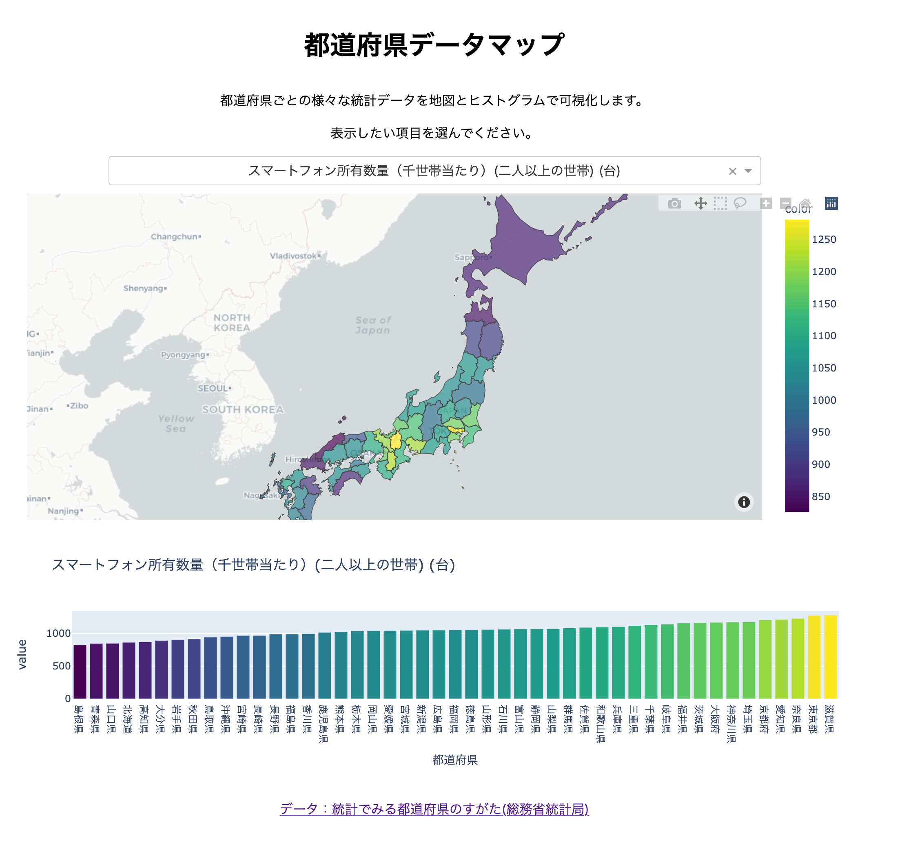

# prefecture-stat

# 都道府県データマップ

都道府県ごとの各種統計データを日本地図とヒストグラムで可視化するシンプルなWEBダッシュボードです。

<a href="https://prefecture-stat.herokuapp.com" target="_blank" rel="noopener noreferrer">https://prefecture-stat.herokuapp.com</a>	(ロードに少し時間がかかります)

参照元データ:
<a href="https://www.stat.go.jp/data/k-sugata/index.html" target="_blank">総務省統計局データ「統計でみる都道府県のすがた」</a>	

* app.py

  本体。dashで動作

* data/all_data.csv

  「統計でみる都道府県のすがた2021」全データ

* data/japan.geojson
  
  都道府県のgeojsonファイル

* Procfile
  
  Heroku上で起動するためのコマンドを定義

* requirements.txt
  
  Heroku用　必要ライブラリのリスト

* runtime.txt
  
  Heroku用 pythonバージョンを指定

* test.ipynb
  
  テスト用ノートブック

